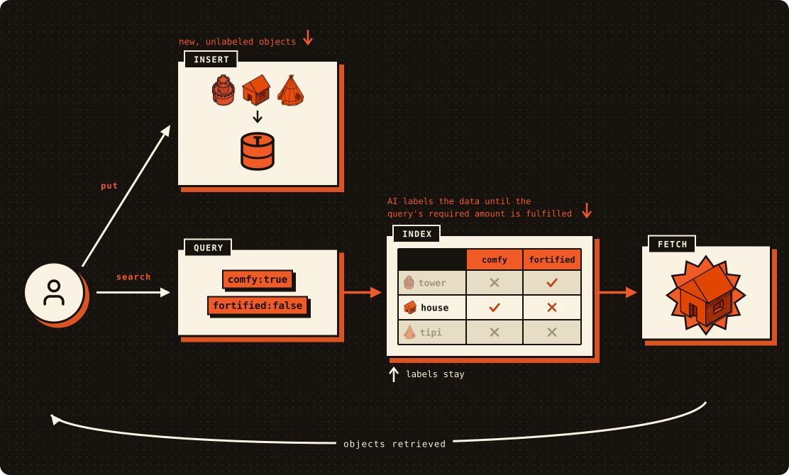
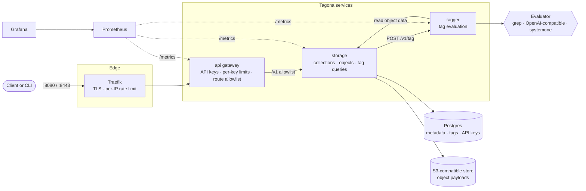
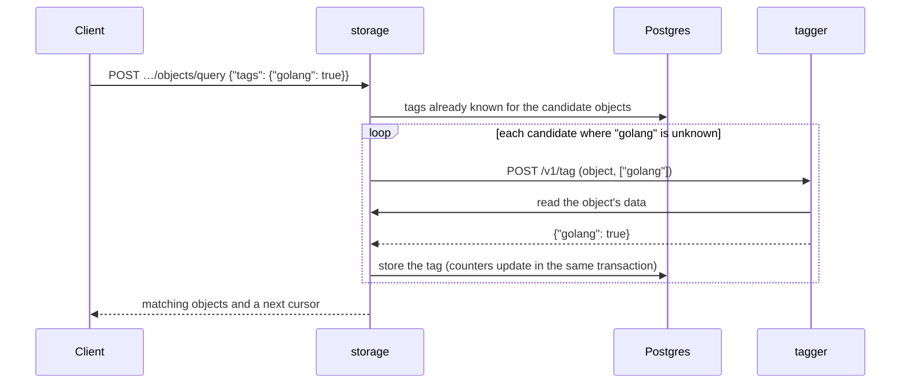

<p align="center">
  <a href="https://tagona.dev"></a>
</p>

<p align="center">
  <a href="https://tagona.dev">tagona.dev</a>
</p>

<p align="center">
  <b>A self-hosted storage system that finds objects by the context in them.</b><br>
  Upload raw data, query by a set of labels that represent the traits of objects you need, and let Tagona fetch them for you.
</p>

<p align="center">
  <a href="https://github.com/MrSydar/tagona/actions/workflows/ci.yml"></a>
  <a href="LICENSE"></a>
  
</p>

<p align="center">
  <a href="#demo">Demo</a> ·
  <a href="#quickstart">Quickstart</a> ·
  <a href="#configuration">Configuration</a> ·
  <a href="#security">Security</a> ·
  <a href="#project-structure">Project structure</a> ·
  <a href="#architecture">Architecture</a> ·
  <a href="#license">License</a>
</p>

---

Tagona stores collections of objects and lets you query them by **yes/no tags you never defined in advance**. There is no schema and no labeling step: you upload raw bytes. The first time a query needs a tag for an object, Tagona asks a pluggable **evaluator** (System One Models, Decision API, an LLM, a substring match, your own implementation) and **stores the answer**, so every object is evaluated for every tag at most once. The more you ask, the faster it answers, eventually answering the most frequent queries in the blink of an eye with minimal cost while still keeping a capability to process new and unknown cases.

<p align="center">
  
</p>

- **Ask for any tag, any time.** Tags are not declared up front; a query is the only thing that creates them. Your query can contain existing tags already queried in the past, completely new ones never seen before and yet to be evaluated once the query is running, or a mix of both.
- **Labeled on demand, remembered for next time.** Each tag is evaluated for an object only when a query needs it, and the answer is stored for future use.
- **Pluggable evaluators.** Ships with System One (`systemone`, through the Vercel AI Gateway today, with Jev, OpenAI's Decision API and more to be added), any OpenAI-compatible LLM (`openai`), and an offline substring matcher (`grep`). Add your own by implementing one Go interface.
- **Know what you have.** Per-collection object counts and per-tag true / false / unknown counts, maintained transactionally by Postgres.
- **Documented API.** The gateway serves interactive docs (Swagger UI) and an OpenAPI 3 contract, so you can try every endpoint and generate clients without reading source.
- **Operable by default.** API keys, per-key and per-IP rate limits, TTL retention, content-hash de-duplication, Prometheus metrics and a Grafana dashboard.
- **Boring, self-hosted stack.** Go services, Postgres and any S3-compatible object store, started with one `docker compose up`.

> The bundled evaluators work on text objects today. Object data types are generic in the engine, so other types arrive with new evaluators.

## Demo

A real session against a local stack (`grep` evaluator; `$AUTH` is `Authorization: Bearer <api key>`, see [Quickstart](#quickstart)). Three job postings go in with no labels at all:

```bash
curl -s -X POST "$API/v1/collections/jobs/objects?data_type=txt" -H "$AUTH" -d 'Senior Go engineer. Remote. Kubernetes and Postgres.'
curl -s -X POST "$API/v1/collections/jobs/objects?data_type=txt" -H "$AUTH" -d 'Data scientist. Python and SQL. Onsite in Berlin.'
curl -s -X POST "$API/v1/collections/jobs/objects?data_type=txt" -H "$AUTH" -d 'Go backend developer. Remote-first team. Postgres.'

curl -s "$API/v1/collections/jobs/tags" -H "$AUTH"
# {"collection":"jobs","total_objects":3,"tags":[]}          <- three objects, no tags known yet
```

Now ask for tags nobody ever defined. Tagona evaluates them while the query runs:

```bash
curl -s -X POST "$API/v1/collections/jobs/objects/query" -H "$AUTH" \
  -H 'Content-Type: application/json' -d '{"tags":{"Go":true,"Remote":true},"limit":5}'
# {"objects":[{"id":"fe6dc2b7-…","size_bytes":50,"tags":{"Go":true,"Remote":true},…},
#             {"id":"e6c22367-…","size_bytes":52,"tags":{"Go":true,"Remote":true},…}]}   <- 2 of 3 match
```

The answers are kept. Every object now has a known value for both tags, so asking again costs nothing:

```bash
curl -s "$API/v1/collections/jobs/tags" -H "$AUTH"
# {"collection":"jobs","total_objects":3,"tags":[
#   {"tag":"Go",    "true_count":2,"false_count":1,"unknown_count":0},
#   {"tag":"Remote","true_count":2,"false_count":1,"unknown_count":0}]}
```

New objects start out *unknown*. Add one more posting and ask for known answers only (`evaluate: false` never calls the tagger):

```bash
curl -s -X POST "$API/v1/collections/jobs/objects?data_type=txt" -H "$AUTH" -d 'Go platform engineer. Remote.'

curl -s "$API/v1/collections/jobs/tags" -H "$AUTH"
# … {"tag":"Go","true_count":2,"false_count":1,"unknown_count":1} …   <- the new object is not evaluated yet

curl -s -X POST "$API/v1/collections/jobs/objects/query" -H "$AUTH" \
  -H 'Content-Type: application/json' -d '{"tags":{"Go":true,"Remote":true},"evaluate":false}'
# 2 objects: only those already known to match. Drop "evaluate" and the new posting is evaluated and returned too.
```

## Quickstart

**You need** Docker with Compose v2. Go 1.26+ is only needed to build the CLI or run the tests.

**1. Get the code and configure the tagger.** Compose reads the tagger's settings from a `.env` file, and refuses to start without one:

```bash
git clone https://github.com/MrSydar/tagona.git && cd tagona
cp tagger/.env.example .env      # defaults to the offline `grep` evaluator, no API keys needed
```

**2. Start everything.**

```bash
docker compose up --build -d
curl -s http://localhost:8080/readyz     # prints "ok" once the stack is up (about 15 seconds)
```

**3. Create an API key.** Every `/v1/collections…` call needs one. Keys are minted with the admin credentials from `compose.yaml` (`admin` / `tagona` for local development) and shown only once:

```bash
API=http://localhost:8080
KEY=$(curl -s -u admin:tagona -X POST $API/v1/admin/api-keys \
  -H 'Content-Type: application/json' -d '{"name":"dev"}' | python3 -c 'import sys,json;print(json.load(sys.stdin)["key"])')
AUTH="Authorization: Bearer $KEY"
```

**4. Create a collection, upload, query.**

```bash
curl -s -X POST $API/v1/collections -H "$AUTH" -H 'Content-Type: application/json' \
  -d '{"name":"jobs","data_type":"txt"}'

curl -s -X POST "$API/v1/collections/jobs/objects?data_type=txt" -H "$AUTH" \
  -H 'Content-Type: application/octet-stream' -d 'hello golang qa'

curl -s -X POST $API/v1/collections/jobs/objects/query -H "$AUTH" \
  -H 'Content-Type: application/json' -d '{"tags":{"golang":true},"limit":5}'
```

Look at one object's tags, or at the whole collection:

```bash
curl -s -H "$AUTH" "$API/v1/collections/jobs/objects/{id}/tags?tags=golang,qa"   # evaluates tags that are not known yet
curl -s -H "$AUTH" "$API/v1/collections/jobs/tags"                               # object count + every tag with true/false/unknown counts
```

**Explore the API.** The gateway serves its own reference at **<http://localhost:8080/v1/docs>** (Swagger UI): click **Authorize**, paste your API key, and try any endpoint. The OpenAPI 3 contract is at `/v1/openapi.json` and `/v1/openapi.yaml`, ready for client generators. These three URLs need no API key. The UI loads Swagger UI from a CDN, so the browser needs internet access to render it; the JSON and YAML do not.

**Query options** (request body of `…/objects/query`; see the interactive docs or [`api/README.md`](api/README.md) for the full API):

| Option | Default | Meaning |
|--------|---------|---------|
| `tags` | none | Tag → required value, all ANDed. Omit to list objects without tag filtering. |
| `limit` / `cursor` | server default / none | Page size, and the `next` cursor from the previous page. |
| `date` | none | Range filter on the object date (`gt`, `gte`, `lt`, `lte`, `eq`, RFC 3339). |
| `evaluate` | `true` | `false` answers from known tags only and never calls the tagger. The same flag exists on the object tags endpoint (`?evaluate=false`), where unevaluated tags come back as `null`. |
| `timeout_ms` | `30000` | Query timeout, between `1000` and `300000`. |
| `best_effort` | `false` | On timeout, return the matches found so far plus a `next` cursor instead of failing. |

**What is running**

| Service | Address | Notes |
|---------|---------|-------|
| API (through Traefik) | `http://localhost:8080` and `https://localhost:8443` | The only public entrypoint, with docs at `/v1/docs`. `:8443` uses a self-signed certificate (`curl -k`). |
| Prometheus | `http://localhost:9090` | Scrapes `api`, `storage` and `tagger`. |
| Grafana | `http://localhost:3000` | `admin` / `admin`, with the provisioned **Tagona** dashboard. |
| Postgres, Garage (S3), tagger | `:5432`, `:3900` / `:3903`, `:8081` | Published for development only. See [Security](#security). |

**CLI and tests**

```bash
make build-client                                   # builds bin/tagona
bin/tagona --url $API --token "$KEY" list-collections
bin/tagona --url $API --token "$KEY" query --collection jobs --tag golang --evaluate=false

make e2e                                            # end-to-end tests against the running stack
make all                                            # build every binary into bin/
for m in api storage tagger; do (cd $m && go test ./...); done   # unit tests (see CONTRIBUTING.md for the full checks)
```

## Configuration

Every service is configured with environment variables. In Docker Compose they are set in `compose.yaml`; the tagger also reads `.env`. Each service README has the long form: [`api`](api/README.md), [`storage`](storage/README.md), [`tagger`](tagger/README.md), [`traefik`](traefik/README.md).

<details open>
<summary><b>API gateway</b> (<code>api</code>)</summary>

| Variable | Default | Description |
|----------|---------|-------------|
| `API_HTTP_ADDR` | `:8080` | Listen address. |
| `API_STORAGE_BASE_URL` | required | URL of the internal storage service. |
| `API_ADMIN_USERNAME` / `API_ADMIN_PASSWORD` | unset | Admin credentials (HTTP Basic) for API key management. If either is unset, the admin endpoints are disabled. |
| `API_MAX_BODY_BYTES` | `33554432` | Request body cap (32 MiB); `0` disables. Storage applies its own per-object limit. |
| `API_KEY_CACHE_TTL` | `30s` | How long key-validation results are cached; `0` disables. |
| `API_RATE_LIMIT_RPS` / `API_RATE_LIMIT_BURST` | `100` / `200` | Per-API-key rate limit; RPS `0` disables. |

</details>

<details>
<summary><b>Edge proxy</b> (<code>traefik</code>)</summary>

| Variable | Default | Description |
|----------|---------|-------------|
| `EDGE_RATE_LIMIT_AVERAGE` / `EDGE_RATE_LIMIT_BURST` | `200` / `400` | Per-client-IP rate limit, in requests per second. |

</details>

<details>
<summary><b>Storage</b> (<code>storage</code>)</summary>

| Variable | Default | Description |
|----------|---------|-------------|
| `TAGONA_HTTP_ADDR` | `:8082` | Listen address. |
| `TAGONA_PG_DSN` | required | Postgres connection string. |
| `TAGONA_S3_ENDPOINT`, `TAGONA_S3_BUCKET` | required | S3-compatible endpoint and bucket. |
| `TAGONA_S3_ACCESS_KEY` / `TAGONA_S3_SECRET_KEY` | required | S3 credentials. |
| `TAGONA_S3_REGION` / `TAGONA_S3_FORCE_PATH_STYLE` | `us-east-1` / `true` | S3 region and path-style addressing. |
| `TAGONA_TAG_ENGINE_URL` | required | URL of the tagger. Storage exits on startup if it cannot reach it. |
| `TAGONA_TAG_ENGINE_TIMEOUT` | `30s` | Timeout of a single tagger request. |
| `TAGONA_DEFAULT_LIMIT` / `TAGONA_MAX_LIMIT` | `5` / `100` | Default and maximum query page size. |
| `TAGONA_MAX_TAGS_PER_QUERY` | `100` | Maximum tags in one query. |
| `TAGONA_MAX_OBJECT_SIZE_BYTES` | `10485760` | Maximum object size (10 MiB). |
| `TAGONA_DEFAULT_TTL` | `0` | Default object lifetime (seconds or a duration); `0` keeps objects forever. |
| `TAGONA_RETENTION_SWEEP_INTERVAL` | `60s` | How often the retention sweeper runs. |
| `TAGONA_RETENTION_BATCH_SIZE` | `100` | Expired objects removed per batch; each run drains the whole backlog batch by batch. |

</details>

<details>
<summary><b>Tagger</b> (<code>tagger</code>)</summary>

| Variable | Default | Description |
|----------|---------|-------------|
| `TAGGER_HTTP_ADDR` | `:8081` | Listen address. |
| `TAGGER_STORAGE_BASE_URL` | `http://localhost:8082` | Storage URL the tagger reads object data from. |
| `TAGGER_EVALUATOR_IMPL` | `grep` | `grep`, `false`, `openai`, or `systemone`. |
| `TAGGER_OPENAI_API_KEY` / `TAGGER_OPENAI_BASE_URL` / `TAGGER_OPENAI_MODEL` / `TAGGER_OPENAI_TIMEOUT` | — / `https://api.openai.com/v1` / `gpt-4o-mini` / `60s` | `openai` evaluator: any OpenAI-compatible chat completions API. |
| `TAGGER_SYSTEMONE_BACKEND` | `vercel` | `systemone` backend (only `vercel` for now). |
| `TAGGER_VERCEL_API_KEY` / `TAGGER_VERCEL_BASE_URL` / `TAGGER_VERCEL_MODEL` / `TAGGER_VERCEL_TIMEOUT` | — / `https://ai-gateway.vercel.sh/v1` / `typesafe-ai/jev` / `60s` | Vercel AI Gateway settings. |
| `TAGGER_VERCEL_THRESHOLD` | `0.5` | A tag is `true` when the returned probability is at least this value. |

Evaluators: `grep` is a case-sensitive substring match on text and needs no network. `false` marks every tag `false` (for testing). `openai` and `systemone` ask an LLM one question per tag.

</details>

## Security

Tagona is meant to run behind its own edge proxy, with the internal services kept off the network. Before you expose it:

- **Change every development default.** `compose.yaml` ships credentials that are public in this repository: admin `admin` / `tagona`, Postgres `tagona` / `tagona`, Garage `tagonadev` / `tagona-dev-secret`, Grafana `admin` / `admin`. Set your own.
- **Only the API entrypoint is meant to be reachable.** `storage` and `tagger` have **no authentication**, because they are internal by design. Compose publishes Postgres, Garage, the tagger, Prometheus and Grafana on the host for convenience; remove those `ports:` entries (or firewall them) outside local development.
- **Use TLS.** `:8443` serves a self-signed certificate until you mount your own (see [`traefik/README.md`](traefik/README.md)). `:8080` is plain HTTP and sends API keys in cleartext, so bind it to loopback or keep it internal in production.
- **API keys and roles.** `/v1` requires a Bearer API key. Keys are stored hashed, shown once at creation, and can be revoked. Key management requires the admin Basic credentials, and an API key is rejected there. There is no RBAC yet: every key can access every collection.
- **The API docs are public by design.** `/v1/docs`, `/v1/openapi.json` and `/v1/openapi.yaml` need no key: they describe the API and contain no data.
- **Built-in protections.** The gateway forwards an explicit allowlist of routes only, rejects path-traversal tricks, caps request bodies, rate limits per API key (and per IP at the edge), and strips the `Authorization` header before a request reaches storage.
- **LLM evaluators send your data to a third party.** With `openai` or `systemone`, object content is sent to the configured API for evaluation. Use `grep`, or a model endpoint you control, for sensitive data.

Found a vulnerability? Please follow [SECURITY.md](SECURITY.md) and do not open a public issue.

## Project structure

```
tagona/
├── api/                  Public API gateway: API-key auth, rate limits, route allowlist, reverse proxy
│   ├── cmd/api/            entry point, router, auth, proxy, docs endpoints
│   ├── openapi/            v1.yaml, the OpenAPI 3 contract of /v1 (embedded, served at /v1/docs)
│   └── internal/           metrics, storage key client
├── storage/              Data service: collections, objects, tags, queries, retention
│   ├── cmd/storage/        service entry point
│   ├── cmd/client/         reference CLI (builds to bin/tagona)
│   ├── pkg/client/         public Go client and the Tagger interface
│   ├── internal/           db, query runner, config, validation, S3 store, retention
│   └── migrations/         SQL migrations, applied on startup (idempotent)
├── tagger/               Tag evaluation service
│   ├── cmd/tagger/         entry point
│   ├── pkg/evaluator/      evaluators: grep, false, openai, systemone (implement your own here)
│   └── pkg/client/         HTTP client that implements storage's Tagger interface
├── traefik/              Edge proxy config: TLS, per-IP rate limiting
├── e2e/                  End-to-end tests against the running stack (separate Go module)
├── prometheus/ grafana/  Metrics scrape config and the Tagona dashboard
├── garage/               Local S3-compatible object store config
├── assets/               README banner
├── .github/              CI workflows, issue and PR templates
├── compose.yaml          Full local stack
├── Makefile              build, e2e, docker shortcuts
└── go.work               Go workspace tying the three service modules together
```

`api`, `storage` and `tagger` are separate Go modules in one workspace; `tagger` imports `storage/pkg/client`, and the workspace (not `go.mod`) resolves it. `AGENTS.md` and `CONTRIBUTING.md` have the details.

## Architecture



**How a query works.** Tags are evaluated only when a query needs them, and every answer is stored:



With `evaluate=false` the loop is skipped: the query reads known tags only and the tagger is never called.

**Design notes**

- **`api` is a thin gateway.** It owns no data. It authenticates, limits, and forwards an allowlist of routes to `storage` without rewriting paths, and it serves the OpenAPI contract and docs for the API it fronts.
- **`storage` owns all state** and is the only service that talks to Postgres and S3. Collection statistics (`object_count`, per-tag counters) are maintained by database triggers, so they always match the data, including after cascading deletes.
- **`tagger` is stateless.** It has no database; it reads object bytes from `storage`, runs the evaluator, and returns booleans.
- **Startup order matters:** Postgres and Garage, then tagger, then storage (it fetches the supported data types from the tagger and exits if it cannot), then api, then Traefik. Compose enforces this with health checks.
- **Uploads are content-addressed.** The SHA-256 of the bytes identifies an object within its collection; uploading the same bytes again returns the existing object.

## Contributing

Issues and pull requests are welcome. See [CONTRIBUTING.md](CONTRIBUTING.md) for the workflow and checks; first-time contributors are asked to sign the [CLA](CLA.md) on their first PR. Please follow the [Code of Conduct](CODE_OF_CONDUCT.md). Adding a public route also means documenting it in `api/openapi/v1.yaml`; a test fails if the spec and the routes drift apart.

## License

Tagona is licensed under the [Apache License 2.0](LICENSE).
