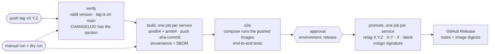

# Releasing Tagona

Tagona is released as three Docker images, published to the GitHub Container Registry (GHCR):

| Image | Service |
|-------|---------|
| `ghcr.io/mrsydar/tagona-api` | the public API gateway |
| `ghcr.io/mrsydar/tagona-storage` | the data service (includes the database migrations) |
| `ghcr.io/mrsydar/tagona-tagger` | the tag evaluation service |

A release is started by pushing a version tag (`vX.Y.Z`). Everything after that is automated by
[`.github/workflows/release.yml`](.github/workflows/release.yml), with one manual approval before
anything is published under a release tag.

- [Versioning](#versioning)
- [The release flow](#the-release-flow)
- [One-time GitHub setup](#one-time-github-setup)
- [Cutting a release](#cutting-a-release)
- [Dry run](#dry-run)
- [What gets published](#what-gets-published)
- [Running a released version](#running-a-released-version)
- [Verifying an image](#verifying-an-image)
- [Upgrading and rolling back](#upgrading-and-rolling-back)
- [The CI that guards releases](#the-ci-that-guards-releases)
- [Security of the pipeline](#security-of-the-pipeline)
- [Troubleshooting](#troubleshooting)
- [Maintaining the pipeline](#maintaining-the-pipeline)

## Versioning

All three services are released **together under one version** that follows [Semantic Versioning](https://semver.org/).

They are tightly coupled (the tagger imports the storage client, storage and the tagger share an HTTP
contract, the API and storage share the internal key endpoints, and storage owns the migrations), so
independently versioned images would need a compatibility matrix nobody maintains. The cost is
rebuilding an image whose code did not change, which is cheap.

- `vX.Y.Z` is a stable release. `vX.Y.Z-rc.1` (any `-suffix`) is a pre-release.
- The version of the HTTP API contract (`info.version` in `api/openapi/v1.yaml`) is a separate number from the release version.

## The release flow



| Job | What it does |
|-----|--------------|
| `verify` | Checks the version is valid semver, that the tagged commit is on `main`, and (for a stable release) that `CHANGELOG.md` has a `## [X.Y.Z]` section. |
| `build` | One job per service (api, storage, tagger). Builds for `linux/amd64` and `linux/arm64` and pushes **only** `:sha-<commit>`, with a provenance attestation and an SBOM. |
| `e2e` | Starts the compose stack from those pushed images (`docker compose up --no-build --wait`) and runs the end-to-end tests. |
| `promote` | Waits for approval on the `release` environment. Then, per service, adds the release tags to the tested image **without rebuilding** and signs it with cosign (keyless). |
| `release` | Creates the GitHub Release with the changelog notes, the image digests, and run/verify instructions. |

The key property: **the bits that were tested are the bits that ship.** The release tags are added to the
exact image the e2e tests ran against; nothing is rebuilt after the tests.

## One-time GitHub setup

Do this once before the first release.

### 1. Protect the release tags

A tag publishes images, so only admins should be able to create (or move) one.

1. **Settings → Rules → Rulesets → New ruleset → New tag ruleset.**
2. Name `release tags`, **Enforcement status: Active**.
3. **Bypass list → Add bypass →** the **Repository admin** role, mode **Always**.
4. **Target tags → Add target → Include by pattern →** `v*`.
5. Rules: **Restrict creations**, **Restrict updates**, **Restrict deletions**.
6. **Create.**

### 2. Create the approval environment

1. **Settings → Environments → New environment →** `release`.
2. Tick **Required reviewers** and add the maintainers who may approve a release. Leave **Prevent self-review** off if you are the only reviewer.
3. **Deployment branches and tags → Selected branches and tags →** add a **Tag** rule `v*`.

### 3. After the first release: make the packages public

GHCR creates a package as **private** on its first push. After the first release run, open each of
`tagona-api`, `tagona-storage` and `tagona-tagger` under your profile's **Packages**, then
**Package settings → Change visibility → Public**. Each package is linked to this repository by the
`org.opencontainers.image.source` label that the Dockerfiles set, so the workflow's `GITHUB_TOKEN` can push to it.

### 4. Make the new CI jobs required

The `main` ruleset requires specific check names. Add `docker-build (api)`, `docker-build (storage)`,
`docker-build (tagger)` and `release-scripts` once they exist on `main` (Settings → Rules → the `main` ruleset → Require status checks).

## Cutting a release

1. **Prepare the changelog.** In a PR, move the entries under `## [Unreleased]` of `CHANGELOG.md` into a new
   `## [X.Y.Z] - YYYY-MM-DD` section (keep an empty `## [Unreleased]` above it) and merge it. A stable release
   cannot be published without this section.
2. **Make sure `main` is green** (all checks on the commit you are about to tag).
3. **Tag that commit and push the tag:**

   ```bash
   git checkout main && git pull
   git tag -a v1.2.3 -m "Tagona 1.2.3"
   git push origin v1.2.3
   ```

   (Or use **Releases → Draft a new release** and create the tag there. Do not publish the release by hand; the workflow creates it.)
4. **Watch the workflow** (Actions → Release). `verify`, `build` and `e2e` run on their own.
5. **Approve** the `promote` jobs when the `release` environment asks. Only approve once `e2e` is green.
6. **Check the result:** the GitHub Release exists, the three images carry the new tags, and `cosign verify` succeeds (see below).
7. On the very first release, make the three packages public ([setup step 3](#3-after-the-first-release-make-the-packages-public)).

A pre-release (`v1.2.3-rc.1`) follows the same flow. It gets only its exact tag (it never moves `latest`, `X.Y` or `X`), needs no changelog section, and the GitHub Release is marked as a pre-release.
Cut a release candidate first to exercise the pipeline before a real version.

## Dry run

**Actions → Release → Run workflow** and enter a version such as `0.0.0-dryrun`. A manual run validates the
version and builds all three images for both platforms, but **never pushes anything and skips `e2e`, `promote` and `release`**.
Use it to check that the Docker builds still work after changing the Dockerfiles or the workflow.

(The workflow can only be started manually once it exists on the default branch.)

## What gets published

For a stable release `1.2.3`, each of the three images gets:

| Tag | Meaning |
|-----|---------|
| `1.2.3` | exactly this release (never changes) |
| `1.2` | the latest `1.2.x` patch |
| `1` | the latest `1.x.y` |
| `latest` | the latest stable release (not pre-releases) |
| `sha-<commit>` | the commit it was built from (the tested staging image) |

Every image is:

- built for `linux/amd64` and `linux/arm64`;
- run as an unprivileged user (uid 10001);
- labelled with its source repository, version and commit (OCI labels);
- published with a build provenance attestation and an SBOM;
- signed with [cosign](https://github.com/sigstore/cosign) (keyless, using the workflow's OIDC identity).

## Running a released version

The compose services have both `build:` and `image:`. By default `docker compose up --build` builds from
source and tags the images `:dev`. To run a published version instead:

```bash
export TAGONA_VERSION=1.2.3        # or put TAGONA_VERSION=1.2.3 in .env
docker compose pull api storage tagger
docker compose up -d --no-build
```

`--no-build` makes compose use the pulled images. Without it, `up` would also be willing to build from source.

## Verifying an image

```bash
cosign verify ghcr.io/mrsydar/tagona-api:1.2.3 \
  --certificate-oidc-issuer https://token.actions.githubusercontent.com \
  --certificate-identity-regexp '^https://github.com/MrSydar/tagona/\.github/workflows/release\.yml@refs/tags/v'
```

A successful verification proves the image was built and signed by this repository's release workflow from a `v*` tag.
The GitHub Release lists the digest of each image, so you can also pin by digest: `ghcr.io/mrsydar/tagona-api@sha256:…`.

## Upgrading and rolling back

- **Migrations are forward-only.** The storage service applies its SQL migrations on every start and has no automatic down-migration.
- **Back up Postgres before upgrading.**
- **Do not roll an image back past a release that changed the schema** unless that release's notes say the previous version still works with the new schema. Restore a backup instead.
- Upgrade all three services together: they are released and tested as a set.

## The CI that guards releases

These run on every pull request, so a release should never be the first time something is built:

| Check | What it guards |
|-------|----------------|
| `docker-build (api/storage/tagger)` | Builds each image exactly as the release does (one platform, no push) and checks that it runs as non-root and carries the repository label. |
| `release-scripts` | Runs `.github/scripts/test-release-scripts.sh`: version parsing, floating tags, pre-releases, the changelog check, the "tag must be on main" check, and release-notes extraction. |

## Security of the pipeline

- **Only admins can start a release:** the tag ruleset blocks anyone else from creating `v*` tags, and the `release` environment requires approval before anything is published under a release tag.
- **Least privilege:** the workflow defaults to read-only, and each job declares exactly the permissions it needs (`packages: write` only where it pushes, `id-token: write` only to sign, `contents: write` only to create the GitHub Release).
- **Pinned third-party actions:** every action is pinned to a full commit SHA, with the version in a comment.
- **Signed, attested images** (see above).
- **No vulnerability scanner yet.** An image scan (for example Trivy) is a sensible release gate, but it is not wired in because it needs a third-party action whose integrity I could not verify when this was set up. Add one deliberately, pinned to a reviewed commit SHA, and decide whether it should block releases.

## Troubleshooting

| Symptom | Likely cause and fix |
|---------|----------------------|
| `verify` fails: "has no '## [X.Y.Z]' heading" | Move the `[Unreleased]` entries under a `## [X.Y.Z] - date` heading in `CHANGELOG.md`, merge, and tag the new commit. |
| `verify` fails: "is not on main" | The tag points at a commit that is not on `main`. Delete the tag and tag a commit on `main`. |
| `verify` fails: "is not a valid semantic version" | Use `vX.Y.Z` or `vX.Y.Z-rc.1`; no leading zeros. |
| `build` fails for one service | Run the same build locally: `docker build -f <service>/Dockerfile .` (the `docker-build` PR check would normally have caught it). |
| `e2e` fails | The workflow prints the stack logs. Reproduce with `TAGONA_VERSION=sha-<commit> docker compose up -d --no-build --wait api` and `make e2e`. Fix on `main`, then tag a new version. |
| `promote` waits forever | It is waiting for an approval on the `release` environment. |
| `promote` cannot push or sign | Check the job's `permissions`, and that the three packages are linked to this repository. |
| A tag was pushed by mistake | If nothing was promoted yet, delete the tag (and the `sha-` staging images if you want). Never move a tag after images were published under it; cut a new patch version instead. |
| Pulling an image says "denied" or "not found" | The package is still private. See [setup step 3](#3-after-the-first-release-make-the-packages-public). |

## Maintaining the pipeline

- **Release logic** lives in `.github/scripts/` (`release-meta.sh`, `release-notes.sh`) and is tested by `test-release-scripts.sh`. Change the script and its tests together.
- **Bumping a pinned action:** resolve the commit of the new version and update both the SHA and the comment, for example
  `gh api repos/docker/build-push-action/commits/v6 --jq .sha`. Run `actionlint` on the workflows.
- **Reading a digest:** use `docker buildx imagetools inspect <ref> --format '{{json .Manifest}}' | jq -r .digest`.
  (`{{.Manifest.Digest}}` prints the whole descriptor block, not just the digest.)
- **The first real release** is the first time the GHCR push, the cosign signature and the GitHub Release step run for real, since those only work on GitHub.
  Start with a release candidate (`v0.1.0-rc.1`) to confirm them.
